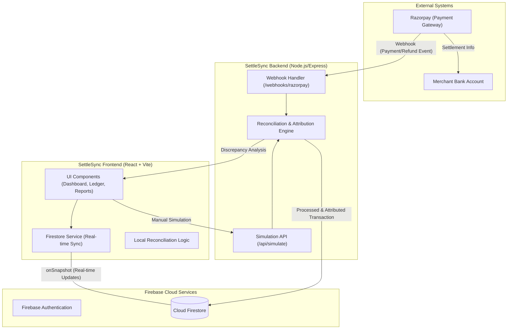

# Payment Charges Breakdown & Reconciliation Platform

## Objective

The Payment Charges Breakdown & Reconciliation Platform is designed to provide merchants with a transparent and clear explanation of digital payment deductions. By comparing expected deductions (based on predefined pricing rules) with actual settlement amounts, the platform identifies and attributes any discrepancies to specific causes such as card network fees, FX charges, or operational anomalies.

## System Overview

The platform operates on a "Transparency First" principle, ensuring that all explanations are presented in plain language and are non-accusatory. It relies on three primary data sources:

1.  **Payment Gateway Webhooks**: Providing transaction IDs, amounts, payment methods, and statuses.
2.  **Settlement Reports**: Containing the final amount settled to the merchant's account.
3.  **Merchant Pricing Configuration**: Defining MDR percentages, GST, and fixed fees for refunds or chargebacks.

## System Architecture

The following diagram illustrates the high-level architecture of SettleSync, showing the flow of data from external payment gateways through the processing engine to the real-time frontend.



### Core Components

- **Frontend**: A modern React application built with Vite, utilizing a glassmorphism design system. It synchronizes with Firestore in real-time to provide instant updates on transaction processing.
- **Backend**: A Node.js/Express server that acts as the entry point for payment gateway webhooks. it performs signature verification, applies the reconciliation engine, and persists data to Firebase.
- **Processing Engine**: The heart of the platform, it calculates expected fees based on merchant pricing and attributes any variances to specific causes with associated confidence levels.
- **Firebase**: Provides secure authentication and a scalable NoSQL database (Firestore) for storing processed transactions and merchant profiles.

## Operational Workflow

### Step 1: Transaction Ledger Creation
For every incoming webhook event, the system creates a ledger entry that captures the original transaction amount and maps it to the corresponding settlement record once available.

### Step 2: Total Deduction Calculation
The system calculates the actual deduction using the formula:
`Total Deduction = Transaction Amount - Settlement Amount`

### Step 3: Expected Fee Estimation
Based on the merchant's one-time pricing configuration (MDR + GST + Fixed Fees), the system calculates the "Expected Gateway Fee".

### Step 4: Difference Detection and Attribution
The difference between the Actual Deduction and the Expected Fee is analyzed through an attribution logic engine:

-   **Matches Refund/Chargeback**: Attributed to Gateway-side deductions.
-   **UPI with Difference > 0**: Classified as an anomaly requiring further clarification.
-   **Domestic Card with Difference > 0**: Attributed to card network or issuing bank charges.
-   **International/EMI with Difference > 0**: Attributed to bank-level FX or EMI processing charges.
-   **No Difference**: Classified as a correct settlement.

Achieved classifications are accompanied by a confidence level (High, Medium, or Low).

## Key Principles

-   **Transparency**: Always provide a plain-language explanation for every deduction.
-   **Neutrality**: Use terms like "attributed to" instead of "charged by" to maintain professional relationships with banks and gateways.
-   **Accuracy**: State "cannot be determined conclusively" if data is insufficient for a high-confidence attribution.

## Technical Implementation

-   **Frontend**: React (Vite) with a modern CSS glassmorphism design system.
-   **Logic**: JavaScript-based reconciliation and attribution engine.
-   **Data Model**: Extensible schemas for Webhooks, Settlements, and Pricing.
    
## Getting Started

### Prerequisites
- [Node.js](https://nodejs.org/) (v18 or higher recommended)
- [npm](https://www.npmjs.com/) (usually comes with Node.js)

### Installation
1.  Clone the repository or download the source code.
2.  Navigate to the project directory:
    ```bash
    cd SettleSync
    ```
3.  Install dependencies:
    ```bash
    npm install
    ```

### Running the Application

1.  **Start the development server:**
    ```bash
    npm run dev
    ```
    The application will be available at `http://localhost:5173`.

2.  **Build for production:**
    ```bash
    npm run build
    ```
    The production-ready files will be generated in the `dist` directory.

3.  **Preview the production build:**
    ```bash
    npm run preview
    ```
